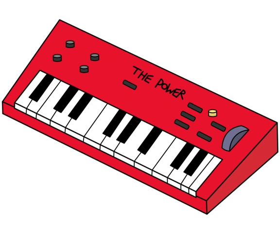

# Project Title

Name:Maleeq Olanlokun

Student Number: C23435852

Class Group: Solo Project

# Description of the project
Inspired by Regular Show, a cartoon I used to watch

# Instructions for use
Press the buttons to hear a piano sound from each button
# How it works
A simple code that attatches a button to a sound

# List of classes/assets in the project and whether made yourself or modified or if its from a source, please give the reference

| Class/asset | Source |
|-----------|-----------|
| MyClass.cs | Self written |
| MyClass1.cs | Modified from []() |
| MyClass2.cs | From [reference]() |

# References


# What I am most proud of in the assignment
I am proud of my ability to replicate the keyboard with illustrator and attach codes to play a sound , I feel like I got the most out of Godot

# Proposal submitted earlier can go here:

## This is how to markdown text:

This is *emphasis*

This is a bulleted list

- Item
- Item

This is a numbered list

1. Item
1. Item

This is a [hyperlink](http://bryanduggan.org)

# Headings
## Headings
#### Headings
##### Headings

This is code:

```GD Script
extends Control


func _ready():
	pass

func _on_button_pressed():
	$AudioStreamPlayer2D.play()
	
	
	
	
	pass # Replace with function body.

```


```


```

This is an image using a relative URL:


This is an image using an absolute URL:


This is a youtube video:

[](https://www.youtube.com/watch?v=J2kHSSFA4NU)

This is a table:

| Heading 1 | Heading 2 |
|-----------|-----------|
|Some stuff | Some more stuff in this column |
|Some stuff | Some more stuff in this column |
|Some stuff | Some more stuff in this column |
|Some stuff | Some more stuff in this column |

