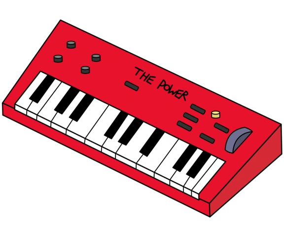
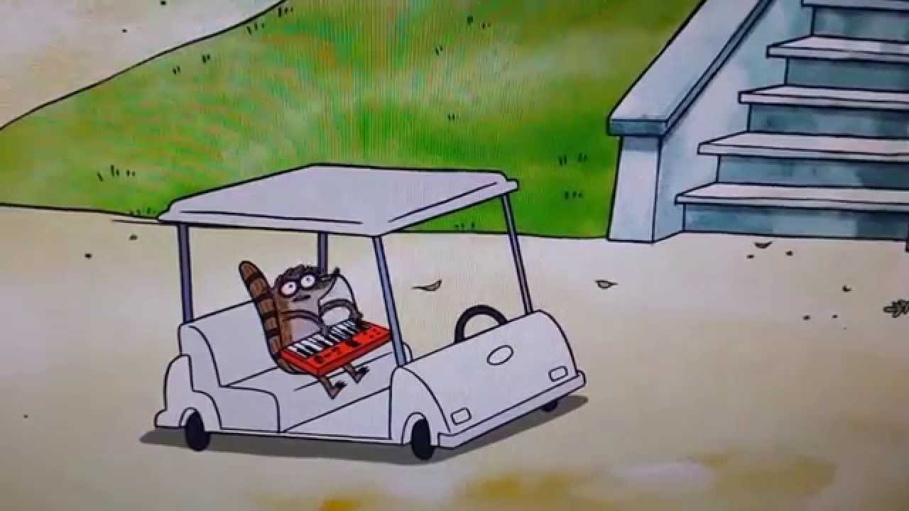
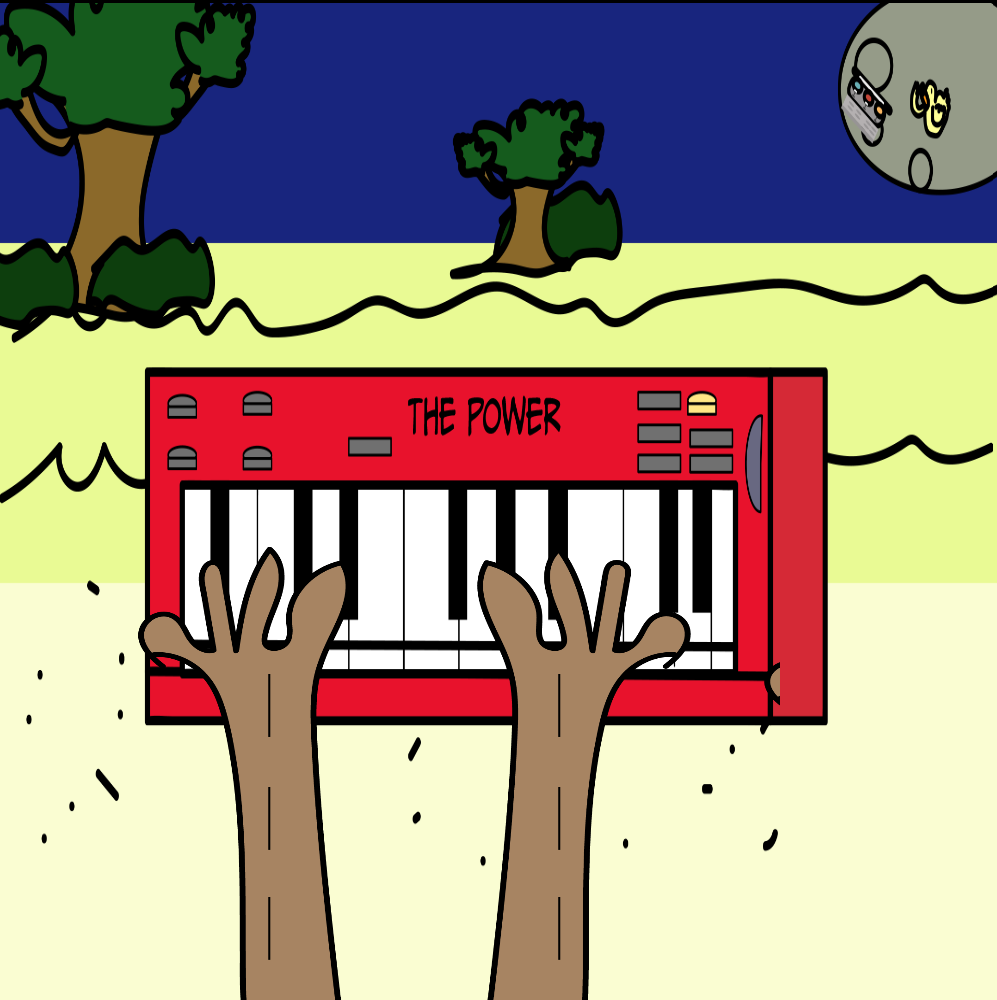

# Project Title

Name:Maleeq Olanlokun

Student Number: C23435852

Class Group: Solo Project

# Description of the project
Inspired by Regular Show, a cartoon I used to watch

# Instructions for use
Press the buttons to hear a piano sound from each button
# How it works
A simple code that attatches a button to a sound

# List of classes/assets in the project and whether made yourself or modified or if its from a source, please give the reference

| Class/asset | Source |
|-----------|-----------|
| MyClass.cs | Self written |
| MyClass1.cs | Modified from []() |
| MyClass2.cs | From [reference]() |

# References
[Send it to the moon](image-3.png)

# What I am most proud of in the assignment
I am proud of my ability to replicate the keyboard with illustrator and attach codes to play a sound , I feel like I got the most out of Godot


This is a [MyRepo](https://github.com/MaleeqOlan/GP-2023)


This is my code:

```GD Script
extends Control


func _ready():
	pass

func _on_button_pressed():
	$AudioStreamPlayer2D.play()
	
	
	
	
	pass # Replace with function body.

```


```


```

This is an image using a relative URL:


This is a youtube video:

[![YouTubeLink]https://www.youtube.com/watch?v=9_mCnQXuamY

